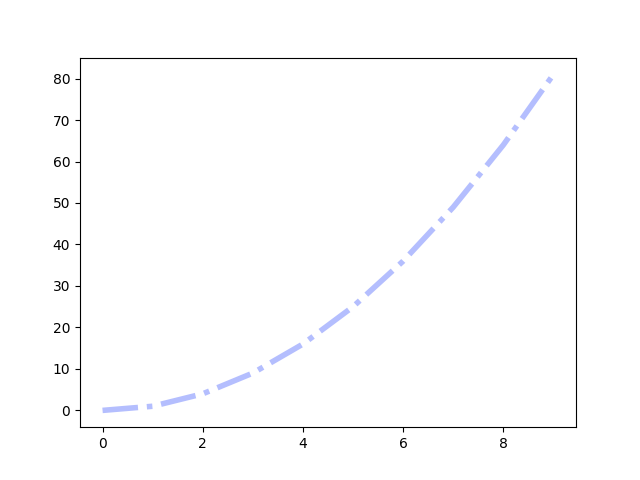
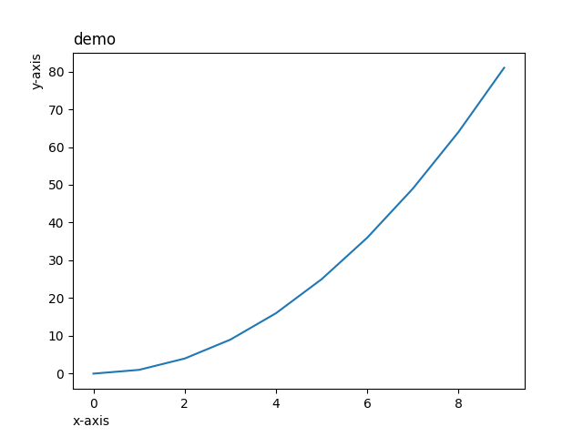
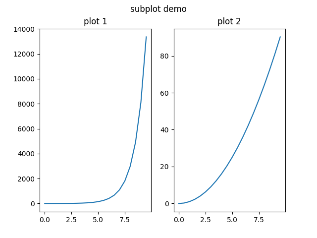
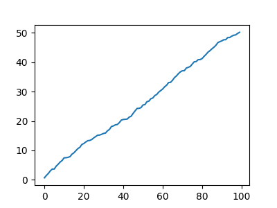
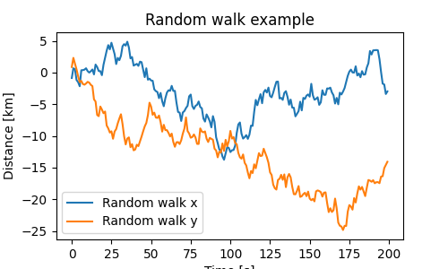
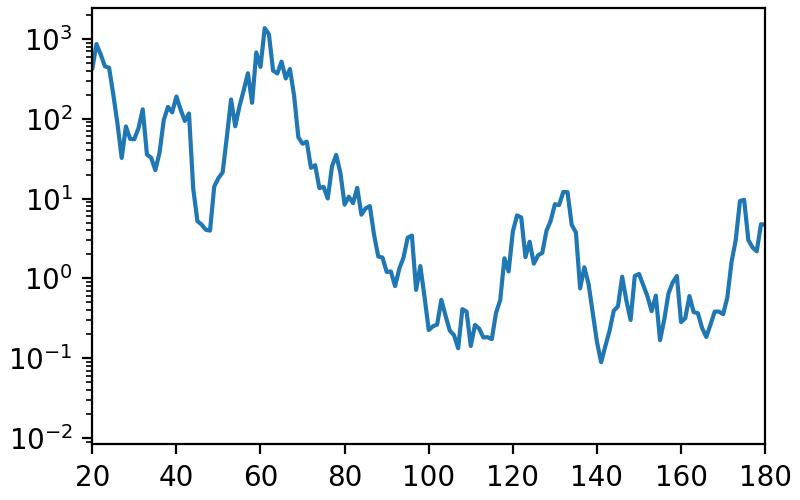
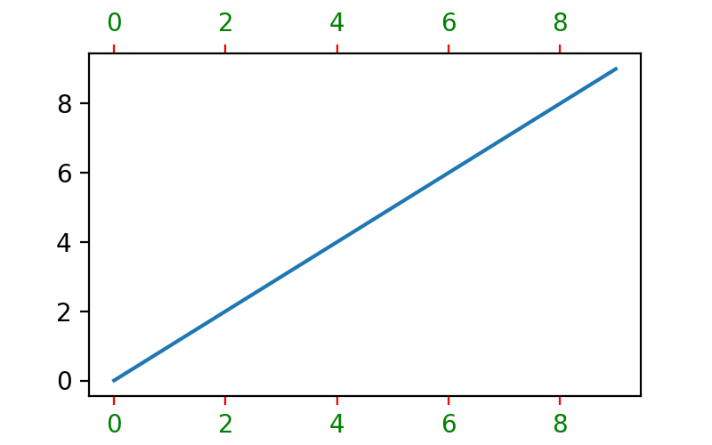
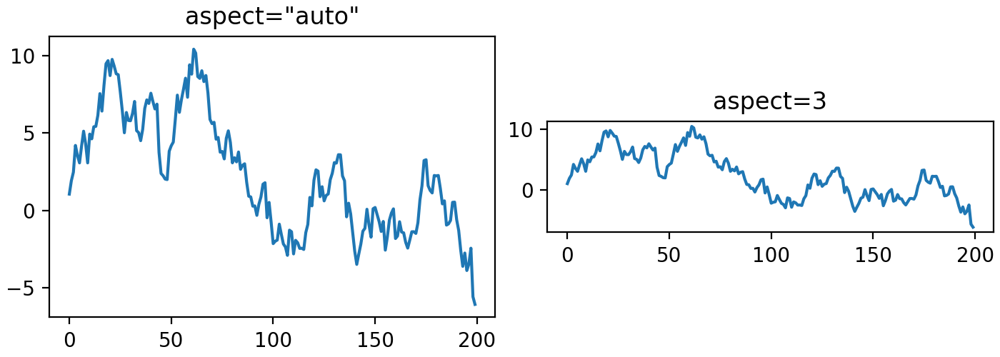

# Matplotlib
## Introduction to pyplot
Pyplot 是 Matplotlib 的子库，提供了和 MATLAB 类似的绘图 API。
Pyplot 是常用的绘图模块，能很方便让用户绘制 2D 图表。
Pyplot 包含一系列绘图函数的相关函数，每个函数会对当前的图像进行一些修改，例如：给图像加上标记，生新的图像，在图像中产生新的绘图区域等等。
Pyplot导入：
```python
import matplotlib.pyplot as plt
```
### plt.plot
`plt.plot` 是绘制二维图形的最基本函数，语法如下：
```python
# 画单条线
plot([x], y, [fmt], *, data=None, **kwargs)
# 画多条线
plot([x], y, [fmt], [x2], y2, [fmt2], ..., **kwargs)
```
* x, y：点或线的节点，x 为 x 轴数据，y 为 y 轴数据，数据可以列表或数组
* fmt：可选，定义基本格式（如颜色、标记和线条样式）
* **kwargs：可选，用在二维平面图上，设置指定属性，如标签，线的宽度等
如：
绘制坐标为(2，1)，(3，5)，(5，3)，(7，2)的点连成的图像
```python
>>> import matplotlib.pyplot as plt
>>> import numpy as np
>>> xpoints = np.array([2,3,5,7])
>>> ypoints = np.array([1,5,3,2])
>>> plt.plot(xpoints,ypoints)
>>> plt.show()
```


调用 `plt.show` 展示图像
如果不指定 x 轴上的点，则 y 的值所对应的 x 默认为 `0, 1, 2, ..., N-1`
```python
>>> ypoints = np.arange(1, 8)
>>> plt.plot(ypoints)
>>> plt.show()
```


绘制正弦和余弦图，参数中包含两对 **x, y** 值，第一对为 **x, y**，对应正弦函数；第二对为 **x, z**，对应余弦函数
```python
>>> x = np.arange(0, 4*np.pi, 0.1)
>>> y = np.sin(x)
>>> z = np.cos(x)
>>> plt.plot(x,y,x,z)
>>> plt.show()
```


### 绘图标记
#### marker
绘图过程如果我们想要给坐标自定义一些不一样的标记，就可以使用 plot() 方法的 `marker` 参数来定义
如在上个实例基础上定义实心圆标记：
```
>>> plt.plot(x,y,x,z,marker = 'o')
>>> plt.show()
```


常用 `marker` 符号：
marker|description|marker|description
:-:|:-:|:-:|:-:
`"."`|点|`","`|像素点
`"O"`|像素点|`"v"`|下三角
`"^"`|上三角|`"1"`|下三叉
`"2"`|上三叉|`"8"`|正八边形
`"s"`|正方形|`"p"`|五边形
`"*"`|星号|`"+"`|加号
`"x"`|乘号|`"None"`|无

可以自定义标记的大小与颜色，使用的参数分别是：
* markersize，简写为 `ms`：定义标记的大小
* markerfacecolor，简写为 `mfc`：定义标记内部的颜色
* markeredgecolor，简写为 `mec`：定义标记边框的颜色
以下实例定义标记大小为15，内部颜色为蓝色，边框颜色为红色
```python
>>> plt.plot(ypoints, marker = 'o', ms = 15, mfc = 'b', mec = 'r')
>>> plt.show()
```


#### fmt
fmt 参数定义了基本格式，如标记、线条样式和颜色
```python
fmt = '[marker][line][color]'
```
如以下实例中的 `*--c`，`*`表示星号，`--`表示点划线，`c`表示青色
```python
>>> ypoints = np.array([1,5,3,2])
>>> plt.plot(ypoints, '*--c')
>>> plt.show()
```


线类型：
marker|description
:-:|:-:
`'-'`|实线
`':'`|虚线
`'--'`|破折线
`'-.'`|点划线

颜色类型：
marker|description|marker|description
:-:|:-:|:-:|:-:
`'r'`|红|`'g'`|绿
`'b'`|蓝|`'c'`|青
`'m'`|品红|`'y'`|黄
`'k'`|黑|`'w'`|白
#### 绘图线
线的类型可以使用 linestyle 参数来定义，简写为 `ls`
type|marker|description
:-:|:-:|:-:
`solid`(default)|`'-'`|实线
`dotted`|`':'`|点虚线
`dashed`|`'--'`|破折线
`dashdot`|`'-.'`|点划线
`None`|`''`|不画线

线的颜色可以使用 color 参数来定义，简写为 `c`

颜色类型与 fmt 相同，也可自定义颜色，如`SeaGreen`，`#8FBC8F`

线的宽度可以使用 linewidth 参数来定义，简写为 `lw`，值可以是浮点数，如：1、2.0、5.67 等
```python
>>> plt.plot(xpoints, y, ls = '-.', c = '#b4befe', lw = 4)
>>> plt.show()
```


#### 轴标题与标签
使用 `xlabel()` 和 `ylabel()` 方法来设置 x 轴和 y 轴的标签
使用 `title()` 方法来设置标题
以上三个方法均提供了 `loc` 参数来设置标签和标题的显示位置
`xlabel` 与 `title` 可设置为 `left`, `right`, `center`(default)
`ylabel` 可设置为 `bottom`, `top`, `center`(default)
```python
>>> x = np.arange(0,10)
>>> y = x ** 2
>>> plt.xlabel("x-axis", loc="left")
>>> plt.ylabel("y-axis", loc="top")
>>> plt.title("demo", loc="left")
>>> plt.plot(x, y)
>>> plt.show()
```


#### 网格线
使用的 `grid()` 方法来设置图表中的网格线
```python
matplotlib.pyplot.grid(b=None, which='major', axis='both', )
```
* `b`：可选，默认为 None，可以设置布尔值，true 为显示网格线，false 为不显示，如果设置 `**kwargs` 参数，则值为 true
* `which`：可选，可选值有 `'major'`(default)、`'minor'` 和 `'both'`，表示应用更改的网格线
* `axis`：可选，设置显示哪个方向的网格线，可以是取 `'both'`(default)，`'x'` 或 `'y'`，分别表示两个方向，x 轴方向或 y 轴方向
* `**kwargs`：可选，设置网格样式，可以是 `color='r'`, `linestyle='-'` 和 `linewidth=2`，分别表示网格线的颜色，样式和宽度
### 绘制多图
#### plt.subplot
```python
plt.subplot(nrows, ncols, index, **kwargs)
plt.subplot(pos, **kwargs)
plt.subplot(**kwargs)
plt.subplot(ax)
```
以上函数将当前图窗分成 `nrows` 行和 `ncols` 列，然后按从左到右，从上到下的顺序以 `1...N` 对每个子区域进行编号，左上的子区域的编号为 1、右下的区域编号为 N，`index` 参数用来指定要在哪块区域创建坐标区，即绘图区域
使用 `plt.suptitle` 为整幅图像添加标题
```python
>>> x = np.arange(0, 10, 0.5)
>>> y = np.exp(x)
>>> plt.subplot(1, 2, 1)    # divide the figure into 1 row and 2 cols and choose the No.1 area
>>> plt.title("plot 1")     # title for subplot 1
>>> plt.plot(x, y)          # draw
>>> z = x**2
>>> plt.subplot(1, 2, 2)
>>> plt.title("plot 2")
>>> plt.plot(x, z)
>>> plt.suptitle("subplot demo")
>>> plt.show()
```


#### plt.subplots
```python
plt.subplots(nrows=1, ncols=1, *, sharex=False, sharey=False, squeeze=True, subplot_kw=None, gridspec_kw=None, **fig_kw)
```
* `nrows`: 默认为 1，设置图表的行数
* `ncols`: 默认为 1，设置图表的列数
* `sharex`, `sharey`: 设置 x、y 轴是否共享属性，可设置为 `none` or `False`(default), `all` or `True`,  `row` or `col`。
`False` or `none`: 每个子图的 x 轴或 y 轴都是独立的
`True` or `all`：所有子图共享 x 轴或 y 轴
`row`: 设置每个子图行共享一个 x 轴或 y 轴
`col`：设置每个子图列共享一个 x 轴或 y 轴
* `squeeze`: 布尔值，默认为 `True`，表示额外的维度从返回的 Axes(轴)对象中挤出，对于 N*1 或 1*N 个子图，返回一个 1 维数组，对于 N*M，N>1 和 M>1 返回一个 2 维数组。如果设置为 False，则不进行挤压操作，返回一个元素为 Axes 实例的2维数组，即使它最终是1x1
* `subpllot_kw`: 可选，字典类型。把字典的关键字传递给 `add_subplot()` 来创建每个子图
* `gridspec_kw`: 可选，字典类型。把字典的关键字传递给 `GridSpec` 构造函数创建子图放在网格里
* `**fig_kw`: 把详细的关键字参数传给 `figure()` 函数

函数返回值为一个二元组，分别表示图形（画窗）和子图对象（坐标区），可以在二元组返回的对象上进行绘图操作。
```python
fig, ax = plt.subplots()
```
与以下代码等价
首先调用 `plt.figure()` 创建一个画窗对象，随后在该对象上添加一行一列一个(对应`(1, 1, 1)`)坐标区
```python
fig = plt.figure()
ax = fig.add_subplot(1, 1, 1)
```
#### Figure & Axes
`axes` 是数据可视化的重要对象。当 `axes` 被添加到 `figure` 后，可以使用许多方法对视图信息进行添加与修改。


上图中，`axes` 对象通过 `ax = fig.subplots()` 创建。图像上的一切都能使用  `ax` 对象进行访问。 
```python
import matplotlib.pyplot as plt
import numpy as np

fig, axs = plt.subplots(ncols=2, nrows=2, figsize=(3.5, 2.5),
                        layout="constrained")
# for each Axes, add an artist, in this case a nice label in the middle...
for row in range(2):
    for col in range(2):
        axs[row, col].annotate(f'axs[{row}, {col}]', (0.5, 0.5),
                            transform=axs[row, col].transAxes,
                            ha='center', va='center', fontsize=18,
                            color='darkgrey')
fig.suptitle('plt.subplots()')
```


在上述实例中，`subplots` 将图窗分为 2 x 2 的网格（grid），因此 `axs` 是一个 `Axes` 对象的 (2,2) 数组。数组中的每个元素都能独立的添加数据
向 `Figure` 添加 `Axes` 的方法有许多：
* `Figure.add_axes`: 需要手动指定位置与大小。`fig.add_axes([0, 0, 1, 1])` 以(0, 0)为左下角的位置添加宽和高均为1的对象。默认情况下，所有值为基于图窗的归一化值
* `plt.subplots` & `Figure.subplots`
##### plot
`axes.Axes` 类提供了许多作图方法，如基础的 `axes.Axes.plot`:
```python
>>> fig, ax = plt.subplots(figsize=(4, 3))
>>> t = np.arange(100)
>>> x = np.cumsum(np.random.rand(100))
>>> lines = ax.plot(t, x)
>>> plt.show()
```


`plot` 返回由 `lines` 对象组成的列表
> 几乎所有在 Matplotlib plot 中能交互的对象都被称为 `Artist`，并且是 `Aritst` 类的子类。如 `Figure`, `Axes`, `lines` 等

##### labelling and annotation
```python
fig, ax = plt.subplots(figsize=(5, 3))
t = np.arange(200)
x = np.cumsum(np.random.randn(200))
y = np.cumsum(np.random.randn(200))
linesx = ax.plot(t, x, label='Random walk x')
linesy = ax.plot(t, y, label='Random walk y')

ax.set_xlabel('Time [s]')
ax.set_ylabel('Distance [km]')
ax.set_title('Random walk example')
ax.legend()
plt.show()
```


`ax.legend()` 用于显示图例，详情请参考<a herf="https://matplotlib.org/stable/users/explain/axes/legend_guide.html#legend-guide">Legend guide</a>
文本同样可通过 `text` 和 `annotate` 方法添加，详见 <a herf="https://matplotlib.org/stable/users/explain/text/text_props.html#text-props">Text properties and layout</a> 与 <a herf="https://matplotlib.org/stable/users/explain/text/annotations.html#annotations">Annotations</a> 
##### limits, scales and ticking
可以通过 `set_xlim` 和 `set_ylim` 等方法对轴进行放缩
```python
fig, ax = plt.subplots(figsize=(4, 2.5), layout='constrained')
np.random.seed(19680801)
t = np.arange(200)
x = 2**np.cumsum(np.random.randn(200))
linesx = ax.plot(t, x)
ax.set_yscale('log')
ax.set_xlim([20, 180])
```


使用 `tick_params` 方法调整 tick 与 ticklabels，如下例将 x 轴标签放在上面，ticks 变红，ticklabels 变绿
```python
fig, ax = plt.subplots(figsize=(4, 2.5))
ax.plot(np.arange(10))
ax.tick_params(top=True, labeltop=True, color='red', axis='x',
               labelcolor='green')
```


##### layout
使用 `set_aspect` 方法调整数据区图像比例
```python
fig, axs = plt.subplots(ncols=2, figsize=(7, 2.5), layout='constrained')
np.random.seed(19680801)
t = np.arange(200)
x = np.cumsum(np.random.randn(200))
axs[0].plot(t, x)
axs[0].set_title('aspect="auto"')

axs[1].plot(t, x)
axs[1].set_aspect(3)
axs[1].set_title('aspect=3')
```


更多内容详见<a href="https://matplotlib.org/stable/api/_as_gen/matplotlib.axes.Axes.html#matplotlib.axes.Axes">官方文档</a>
## Simple Plot
