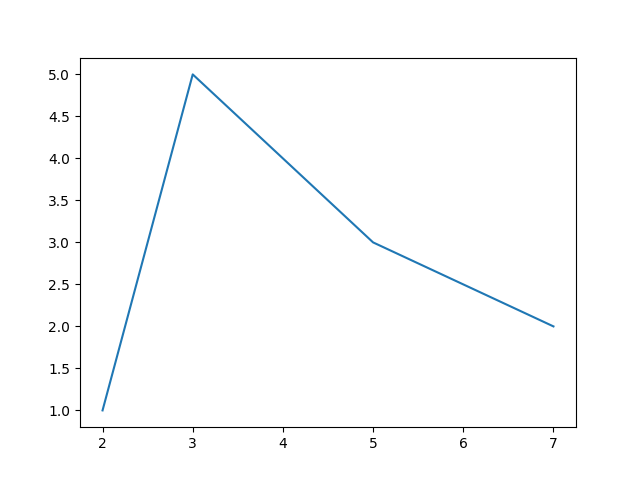
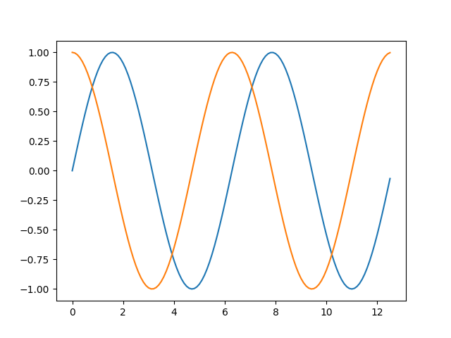
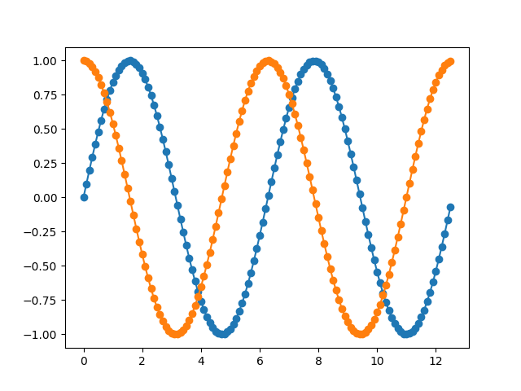
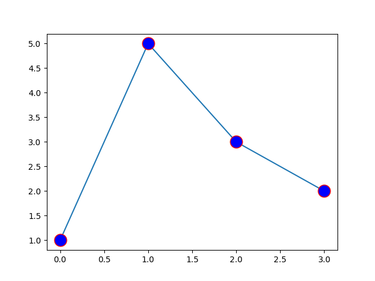
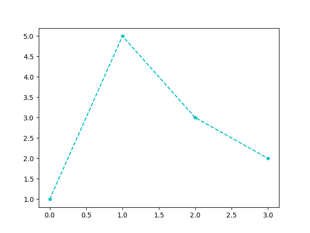

# Matplotlib
## Introduction to pyplot
Pyplot 是 Matplotlib 的子库，提供了和 MATLAB 类似的绘图 API。
Pyplot 是常用的绘图模块，能很方便让用户绘制 2D 图表。
Pyplot 包含一系列绘图函数的相关函数，每个函数会对当前的图像进行一些修改，例如：给图像加上标记，生新的图像，在图像中产生新的绘图区域等等。
Pyplot导入：
```python
import matplotlib.pyplot as plt
```
### plt.plot
`plt.plot` 是绘制二维图形的最基本函数，语法如下：
```python
# 画单条线
plot([x], y, [fmt], *, data=None, **kwargs)
# 画多条线
plot([x], y, [fmt], [x2], y2, [fmt2], ..., **kwargs)
```
* x, y：点或线的节点，x 为 x 轴数据，y 为 y 轴数据，数据可以列表或数组
* fmt：可选，定义基本格式（如颜色、标记和线条样式）
* **kwargs：可选，用在二维平面图上，设置指定属性，如标签，线的宽度等
如：
绘制坐标为(2，1)，(3，5)，(5，3)，(7，2)的点连成的图像
```python
>>> import matplotlib.pyplot as plt
>>> import numpy as np
>>> xpoints = np.array([2,3,5,7])
>>> ypoints = np.array([1,5,3,2])
>>> plt.plot(xpoints,ypoints)
>>> plt.show()
```

调用 `plt.show` 展示图像
如果不指定 x 轴上的点，则 y 的值所对应的 x 默认为 `0, 1, 2, ..., N-1`
```python
>>> ypoints = np.arange(1, 8)
>>> plt.plot(ypoints)
>>> plt.show()
```

绘制正弦和余弦图，参数中包含两对 **x, y** 值，第一对为 **x, y**，对应正弦函数；第二对为 **x, z**，对应余弦函数
```python
>>> x = np.arange(0, 4*np.pi, 0.1)
>>> y = np.sin(x)
>>> z = np.cos(x)
>>> plt.plot(x,y,x,z)
>>> plt.show()
```

### 绘图标记
#### marker
绘图过程如果我们想要给坐标自定义一些不一样的标记，就可以使用 plot() 方法的 `marker` 参数来定义
如在上个实例基础上定义实心圆标记：
```
>>> plt.plot(x,y,x,z,marker = 'o')
>>> plt.show()
```

常用 `marker` 符号：
marker|description|marker|description
:-:|:-:|:-:|:-:
`"."`|点|`","`|像素点
`"O"`|像素点|`"v"`|下三角
`"^"`|上三角|`"1"`|下三叉
`"2"`|上三叉|`"8"`|正八边形
`"s"`|正方形|`"p"`|五边形
`"*"`|星号|`"+"`|加号
`"x"`|乘号|`"None"`|无
可以自定义标记的大小与颜色，使用的参数分别是：
* markersize，简写为 `ms`：定义标记的大小
* markerfacecolor，简写为 `mfc`：定义标记内部的颜色
* markeredgecolor，简写为 `mec`：定义标记边框的颜色
以下实例定义标记大小为15，内部颜色为蓝色，边框颜色为红色
```python
>>> plt.plot(ypoints, marker = 'o', ms = 15, mfc = 'b', mec = 'r')
>>> plt.show()
```

#### fmt
fmt 参数定义了基本格式，如标记、线条样式和颜色
```python
fmt = '[marker][line][color]'
```
如以下实例中的 `*--c`，`*`表示星号，`--`表示点划线，`c`表示青色
```python
>>> ypoints = np.array([1,5,3,2])
>>> plt.plot(ypoints, '*--c')
>>> plt.show()
```

线类型：
marker|description
:-:|:-:
`'-'`|实线
`':'`|虚线
`'--'`|破折线
`'-.'`|点划线

颜色类型：
marker|description|marker|description
:-:|:-:|:-:|:-:
`'r'`|红|`'g'`|绿
`'b'`|蓝|`'c'`|青
`'m'`|品红|`'y'`|黄
`'k'`|黑|`'w'`|白
## Simple Plot
